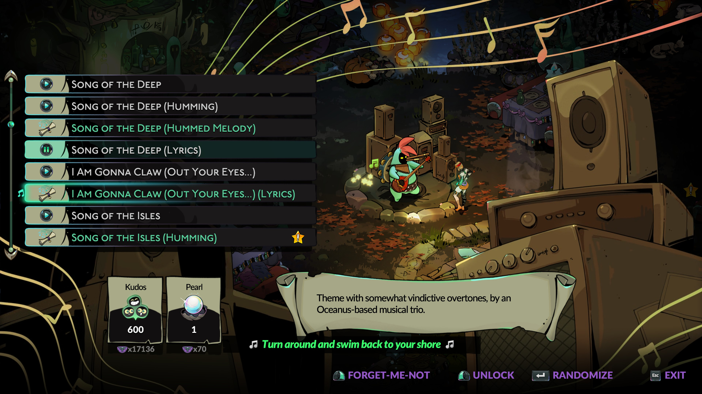

# Crossroads Singing Silver Sisters

This mod adds lyrical versions of the songs that Artemis, Melinoë and Apollo sing in various scenes across the game, to the Crossroads' Music Maker, allowing you to choose between them whenever you want.

The new songs are:

- **Moonlight Guide Us** - three new versions of the song Artemis sings in the Crossroads: An Artemis Solo, a Melinoë Solo, and a Duet version.
- **Fated Glory** - the song Apollo sings in the Palace of Zeus after clearing a Surface run.
- **Time Belongs To Us** - the theme playing during the credits scroll, with Artemis, Melinoë and Apollo singing together.
- **Time Belongs To Us [Crossroads Mix]** - the version of the credits theme sung by Artemis in the Crossroads: An Artemis Solo, a Melinoë Solo, and a Duet version.

To unlock a lyrical version of a song, you first need to own the instrumental version.
For *Moonlight Guide Us* and *Time Belongs To Us [Crossroads Mix]*, unlock Artemis' and Melinoë's solos to unlock the Duet version.

## Other related mods

To further improve your musical experience in the Crossroads, consider installing some of my other mods:

- [Randomize Favourite Songs](https://thunderstore.io/c/hades-ii/p/NikkelM/Randomize_Favorite_Songs/) allows you to favourite songs with the Music Maker, and randomize only from those whenever you return to the Crossroads. Supports all songs added by other mods.
- [Crossroads Singing Sirens](https://thunderstore.io/c/hades-ii/p/NikkelM/Crossroads_Singing_Sirens/) adds lyrical and hummed versions of the songs by Scylla and the Sirens to the Music Maker.
- [Hades OST for the Music Maker](https://thunderstore.io/c/hades-ii/p/NikkelM/Hades_OST_for_the_Music_Maker/) adds songs from the Hades soundtrack (as played by Orpheus) as unlockables to the Music Maker.

## Configuration

If you want to immediately get access to all lyrical versions added through this mod, you can set the `unlockEverything` option to `true` in the config file through r2modman.
Note that this action is **NOT REVERSIBLE**!
